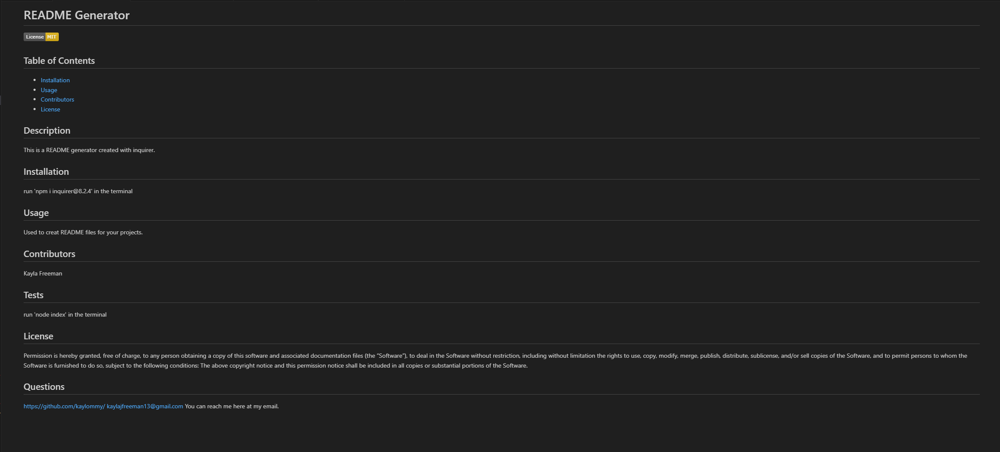

# Professional README Generator Starter Code

[How to create a Professional README](https://coding-boot-camp.github.io/full-stack/github/professional-readme-guide)

## Description
The purpose of this project was to create a README generator with inquirer. When 'node index' is run in the terminal the user will see a series of questions that when answered will be used to generate the README file.

## Screenshot

## Link
Below is a link to the video:
https://drive.google.com/file/d/1V1B3Uoqa-j6HzHPcMqL0HYlXaxc_X8_Q/view
